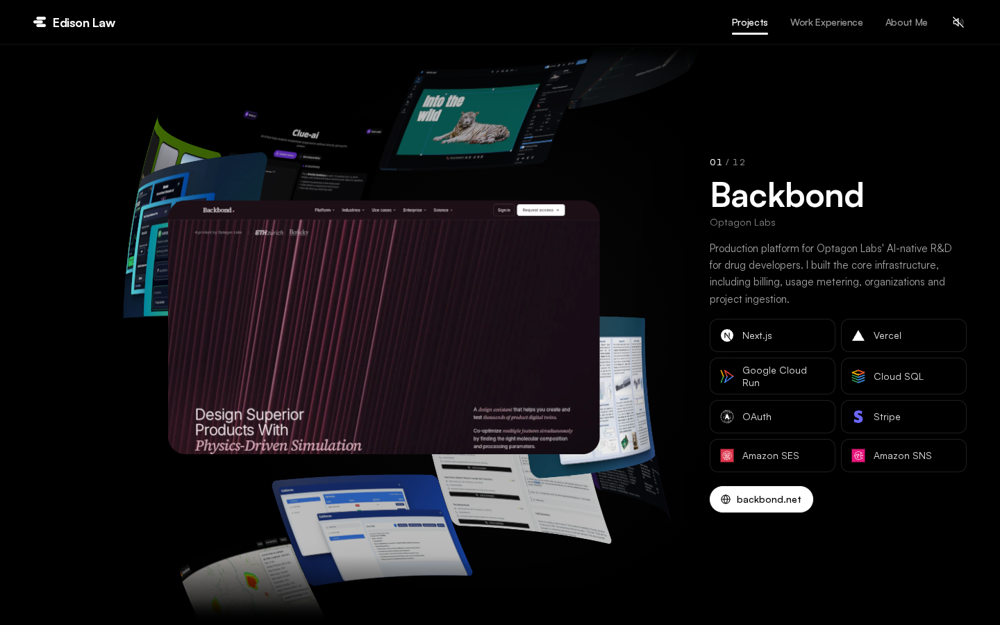
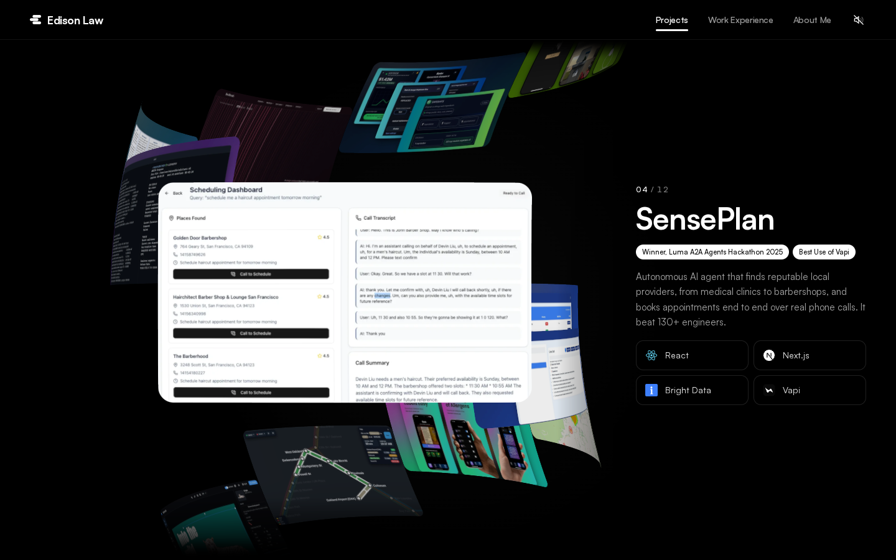
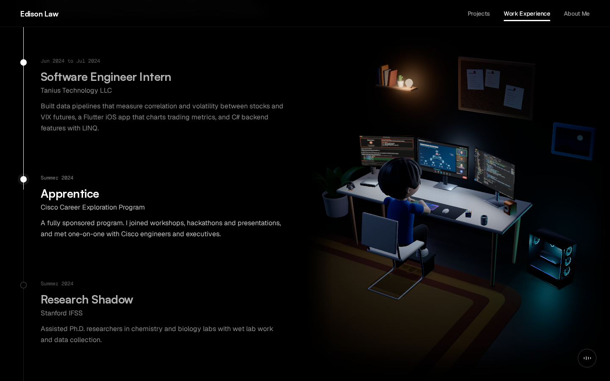
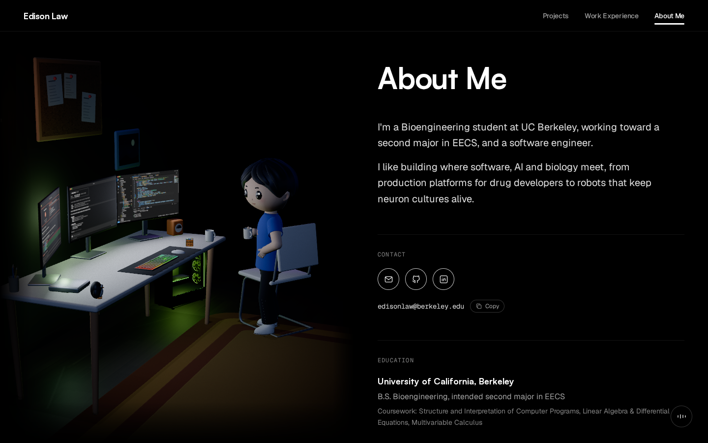
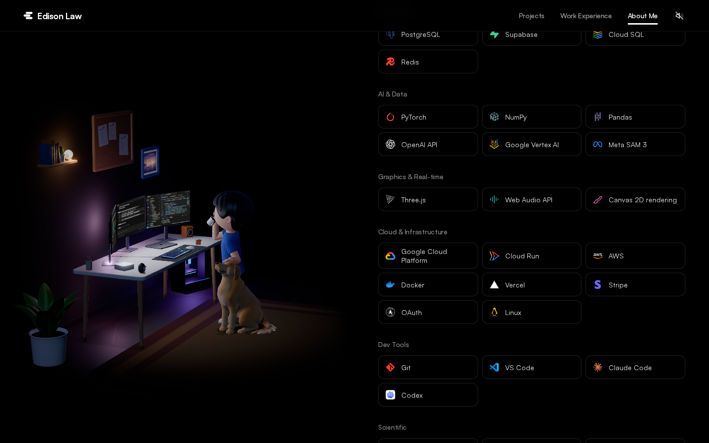
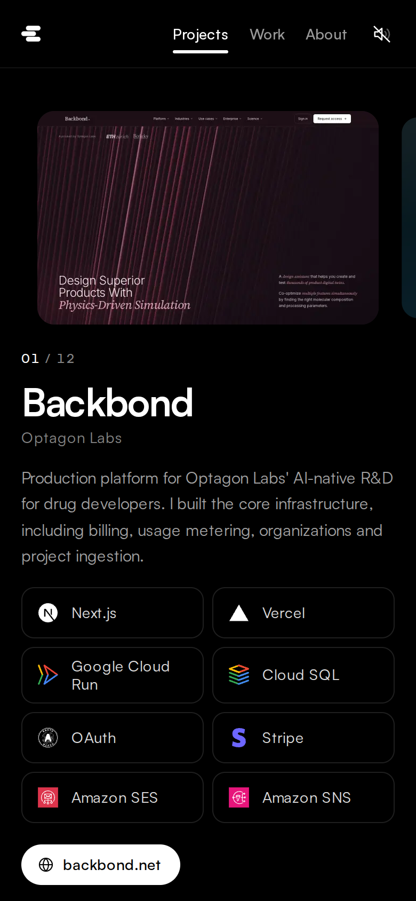
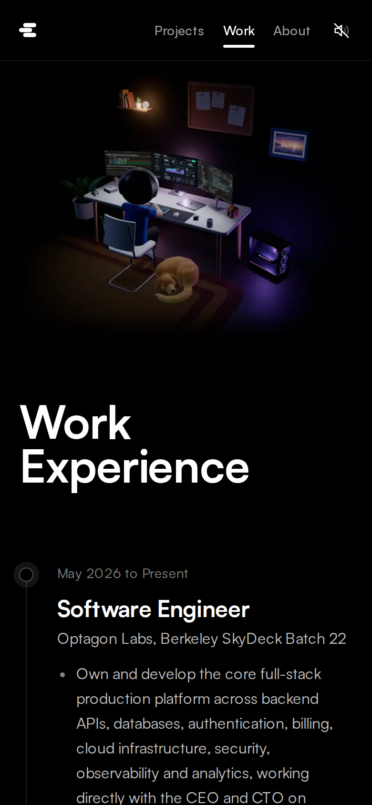

# Edison Law

This is Edison Law's personal website. Edison studies Bioengineering at UC Berkeley, is working toward a second major in EECS, and works as a software engineer. The site is one dark page with three parts:

- **Projects.** A 3D spiral of project cards that you scroll or drag through. When a card locks into focus it comes forward and a panel with its details slides in. A plain list is one click away.
- **Work Experience.** A timeline next to a 3D model of Edison at his desk at night, typing. The centre monitor changes to match the job you are reading, while the room's lighting stays the same.
- **About Me.** The same room with Edison standing and sipping a coffee, next to his intro, contact links, education, skills, honors and activities.

The page is black and white. Colour only shows up inside the 3D scenes, in the project photos and in the skill logos. Once you turn sound on, soft sounds made from scratch follow the scroll.

## Screenshots











| Projects on a phone | Work Experience on a phone |
| --- | --- |
|  |  |

## How it works

### Stack

Next.js 16 with the App Router, React 19 and TypeScript. Tailwind CSS 4 for styling. three.js through React Three Fiber, drei and postprocessing for the 3D. Motion for UI animation, Lenis for smooth scrolling, Howler for audio and Zustand for shared state. Vitest runs the tests. The page is fully static, so it deploys to Vercel as is.

### One page

`src/app/page.tsx` stacks the three sections under a fixed navbar. Lenis gives the scroll its weight. A tracker works out which section is in view, and the navbar's white underline slides to it through a shared Motion layout id. Every piece of copy lives in `src/content`, so all of it is real HTML for search engines and screen readers. The Tailwind palette is cut down to black, white and greys, so no accent colour can sneak into the UI.

### The project spiral

- The section is a tall scroll track with a sticky stage. The scroll position maps to one continuous card index, a damped spring follows it, and everything reads from that one value: where each card sits on the spiral, its blur, its dimming, the curl in the vertex shader and the scroll ticks.
- 24 cards (each project twice, like the site that inspired it) wind around a vertical axis. The fragment shader fits each photo to the card, rounds the corners, blurs cards the further they are from focus, and streaks them sideways when you scroll fast.
- When scrolling stops, the page snaps to the nearest card. That card comes forward, the scene slides left and the detail panel animates in. Drag, click and the arrow keys work too.
- Phones get a swipe carousel instead, and reduced motion starts in the list view. The canvas renders on demand, so it stops drawing when nothing moves.

### The desk scene

- The room, the props and Edison are all built from primitives in code, with no model files. `src/features/workstation/layout.ts` holds the shared measurements, so the desk, keyboard, chair and character line up.
- Edison has a small rig with two-bone IK. Seated, his hands type on the real keyboard position, he glances at the side monitors and now and then reaches for the mouse. Standing, he shifts his weight, sips from his mug and looks between the screens.
- The monitors show Claude Code, Codex and VS Code, painted with Canvas 2D and animated by one shared scheduler. Each job in the timeline has its own picture for the centre monitor.
- The room is lit mostly by the setup: a fixed cool white area light in front of each monitor, steady violet washes on the wall and floor, one RGB clock shared by the tower fans, light strips and the tower's spill, and a faint moonlight. Only the glowing parts and the tower's spill follow the hue, each at one brightness, so the room never dims or shifts while you scroll. Bloom, AgX tone mapping, a vignette and a little grain finish it.
- Canvases mount only when they come near the viewport and pause when they leave it. Screens narrower than 1024px and browsers without WebGL get pre-rendered stills from `public/renders` instead.

### Sound

Every sound is synthesised in Node by `scripts/sounds` from oscillators, seeded noise, filters, envelopes and a small reverb, then packed into one MP3 sprite. Howler only loads after you turn sound on. The engine throttles each sound and varies its pitch a little, so fast scrolling becomes a smooth ratchet instead of noise. A muffled keyboard and fan loop plays near Work Experience and a quieter room tone near About Me. Sound starts off and the site remembers your choice.

### Accessibility and quality

- Reduced motion, keyboard access to the spiral and carousel, a skip link, focus management and AA text contrast.
- three.js loads after the page is interactive, and phones never download it.
- Tests cover the spiral maths, the sound engine and its DSP, the shared helpers and the content. Two guards fail the build on em dashes, bullets or arrows in the copy and on text greys below AA contrast.

## Project layout

```
src/
  app/                 Page, layout, metadata, Open Graph image, robots and sitemap
  content/             All copy: projects, experience, about, site
  components/          Navbar, footer, icons and small shared UI
  features/
    projects/          Spiral stage, shaders, snapping, detail panel, list and phone carousel
    experience/        Timeline and the reading state it shares with the desk scene
    about/             About blocks and the skills grid with its logos
    workstation/       Room, props, lighting, effects, camera, character and monitor screens
    sound/             Howler engine, sprite map and the sound toggle
    navigation/        Smooth scrolling and the active section
  lib/                 Hooks and small helpers shared across features
scripts/
  sounds/              Sound synthesis and checks
  projects/            Recreates the project photos
  capture-renders.mjs  Captures the desk scene stills for phones
  screenshots.mjs      Captures the README screenshots
public/
  projects/            One photo per project
  renders/             Desk scene stills
  skills/              Logos Simple Icons does not ship
  audio/               The sound sprite
```

## Running it

You need Node 20.9 or newer.

```bash
npm install
npm run dev
```

Then open http://localhost:3000.

```bash
npm run build        # production build
npm start            # serve the production build
npm run lint         # ESLint
npm run typecheck    # TypeScript
npm test             # Vitest
npm run sounds       # regenerate the sound sprite
npm run screenshots  # recapture the README screenshots (needs a running build on port 3200)
```

## Updating things

- **Text.** Edit the files in `src/content`.
- **Project photos.** Drop a 1280 x 800 WebP into `public/projects/<project-id>.webp`. `node scripts/projects/capture.mjs <project-id>` recreates the current ones.
- **Desk scene stills.** Run `npm run dev`, then `node scripts/capture-renders.mjs http://localhost:3000`.
- **Sounds.** Edit a recipe in `scripts/sounds/recipes`, run `npm run sounds`, then `npx tsx scripts/sounds/check.ts out.png` to plot and check the result.

## Copyright and usage

Copyright (c) 2026 Edison Law. All rights reserved. The full terms are in [LICENSE](LICENSE).

- You may copy parts of the site for your own personal, non-commercial use only with attribution: credit Edison Law and link to the site or this repository. Copying it for personal use without attribution is prohibited.
- Any other use, including commercial use, republishing and presenting the work as your own, needs Edison's written permission.
- Third-party logos, fonts and libraries stay under their own licenses.
