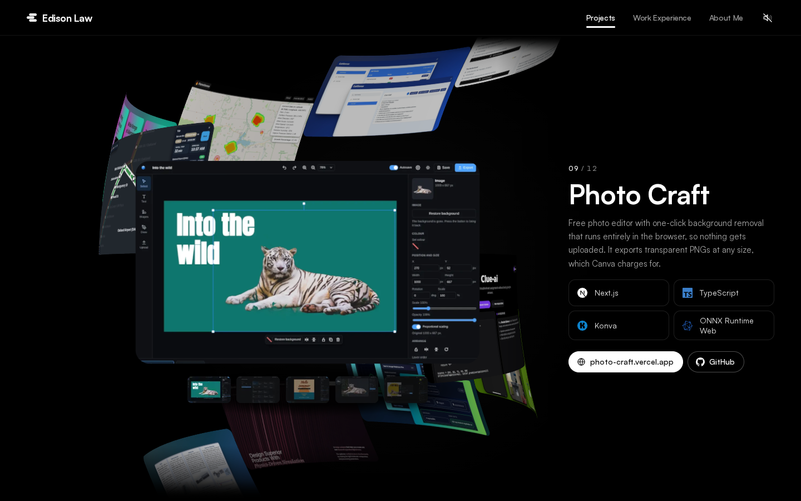

# Edison Law

This is Edison Law's personal website. Edison studies Bioengineering at UC Berkeley, is working toward a second major in EECS, and works as a software engineer. The site is one dark page with three parts:

- **Projects.** A 3D spiral of project cards with one project up close and a panel with its details beside it. The wheel, a swipe or a click on any card turns it to another project.
- **Work Experience.** A timeline next to a 3D model of Edison seated at his desk at night, typing. The centre monitor changes to match the job you are reading, while the room's lighting stays the same.
- **About Me.** The same room with Edison standing by the desk with a coffee, petting his golden retriever as it sits beside him, next to his intro, contact links, education, skills, honors and activities.

The page is black and white in one typeface, Satoshi. Colour only shows up inside the 3D scenes, in the project photos and in the skill logos. Once you turn sound on, soft sounds made from scratch play as the projects turn and as you use the navbar, with quiet loops near the desk.

## Screenshots





| Projects on a phone | Work Experience on a phone |
| --- | --- |
|  |  |

## How it works

### Stack

Next.js 16 with the App Router, React 19 and TypeScript. Tailwind CSS 4 for styling. three.js through React Three Fiber, drei and postprocessing for the 3D. Motion for UI animation, Lenis for smooth scrolling, Howler for audio and Zustand for shared state. Vitest runs the tests. The page is fully static, so it deploys to Vercel as is.

### One page

`src/app/page.tsx` stacks the three sections under a fixed navbar. Lenis gives the scroll its weight. A tracker works out which section is in view, and the navbar's white underline slides to it through a shared Motion layout id. Every piece of copy lives in `src/content`, so all of it is real HTML for search engines and screen readers. The Tailwind palette is cut down to black, white and greys, so no accent colour can sneak into the UI, and every font token points at Satoshi.

### The project spiral

- The stage is one viewport tall and the page scrolls past it like any other section. It opens on the featured project, set in `src/content/projects.ts`, and there is no title over it.
- The cards wind around a vertical axis like a spiral staircase, and every project appears twice so the loop never runs out of cards. It turns round and round forever. Going forward moves the strand to the left.
- The wheel over the spiral turns it one project per notch or trackpad swipe, and the page stays put. Over the detail panel, the wheel scrolls the page as usual. A click on any card in sight spins straight to it. The left and right arrow keys still work, and their step buttons only show when they take keyboard focus.
- The card in focus comes forward flat and bigger than the rest, and its detail panel slides in beside it, or below it on narrower screens. A project with screenshots, like Photo Craft with its five, gets a row of them under the card, and a click on one shows it on the card.
- The vertex shader bends each card around the cylinder and bows it with speed. The fragment shader fits each photo to the card and rounds the corners, and every card stays sharp. The canvas renders on demand, so it stops drawing when nothing moves.
- Phones get a swipe strip of the same projects instead, and browsers without WebGL get it on every screen. Reduced motion keeps the spiral but makes each move short and calm.

### The desk scene

- The room, the props, Edison and his dog are all built from primitives in code, with no model files. `src/features/workstation/layout.ts` holds the shared measurements, so the desk, keyboard, chair, character and dog line up.
- Edison has a small rig with two-bone IK. Seated, his hands type on the real keyboard position and his feet hang free under the chair, with no footrest. Standing, he sips his coffee, stops to think and strokes the golden retriever, which sits at his side, leans into his hand and sweeps its tail. The dog is sculpted in a worker and fades in once it is ready.
- The desk has three matching monitors, a Mac mini and a MacBook Pro with its lid shut. The wall has a shelf, a cork board and a framed picture of a sailboat at dusk.
- The monitors show Claude Code, Codex and VS Code, painted with Canvas 2D at high resolution and animated by one shared scheduler. The faces are shown exactly as painted and sampled carefully, so their text stays sharp. Each job in the timeline has its own picture for the centre monitor.
- The lighting is steady and bright. Each monitor throws the same cool white area light whatever it shows, the RGB setup spills a soft violet onto the floor and the wall behind the desk, and a faint moonlight comes from the left. None of it changes while you scroll, so only the centre screen changes. One RGB clock cycles the hue of the glowing parts alone, the tower fans and light strips. Bloom, AgX tone mapping, a vignette and a little grain finish it.
- Canvases mount only when they come near the viewport and pause when they leave it. Screens narrower than 1024px and browsers without WebGL get pre-rendered stills from `public/renders` instead, and desktops show a poster still while the canvas loads.

### Sound

Every sound is synthesised in Node by `scripts/sounds` from oscillators, seeded noise, filters, envelopes and a small reverb, then packed into one MP3 sprite. Howler only loads after you turn sound on. The engine throttles each sound and varies its pitch a little. The project spiral and the phone strip play one soft sound each time they move to another project, and a quick spin or a long glide counts as one move. A muffled keyboard and fan loop plays near Work Experience and a quieter room tone near About Me. Sound starts off and the site remembers your choice.

### Accessibility and quality

- Reduced motion, keyboard access to the spiral and the phone strip, a skip link, focus management and AA text contrast. A plain list of every project stays in the page for screen readers and search engines.
- three.js loads after the page is interactive, and phones never download it.
- Tests cover the spiral maths, the wheel and swipe input, the sound engine and its DSP, the character and dog poses, the lighting, the shared helpers and the content. Three guards fail the build on em dashes, bullets or arrows in the copy, on text greys below AA contrast and on any font family class besides Satoshi outside the painted monitor screens.

## Project layout

```
src/
  app/                 Page, layout, fonts, metadata, Open Graph image, robots and sitemap
  content/             All copy: projects, experience, about, site
  components/          Navbar, footer, icons, skill cards and small shared UI
  features/
    projects/
      stage/           Spiral stage, detail panel, screenshot row and step buttons
      spiral/          Canvas, card layout, shaders, focus and motion
      input/           Wheel, swipe and arrow key steering
      gallery/         Screenshot rows for projects that have them
      mobile/          The phone swipe strip
      state/           Shared spiral state
    experience/        Timeline and the reading state it shares with the desk scene
    about/             About blocks and the skills grid
    workstation/
      scene/           Room, rug and the scene itself
      props/           Desk, chair, monitors, keyboard, Apple devices, tower and decor
      character/       Edison, his rig and poses
      dog/             The golden retriever, its sculpt and rig
      screens/         Painted monitor screens
      lighting/        Screen lights, RGB spill and the RGB clock
      camera/          Camera framing for each section
      effects/         Bloom, tone mapping, vignette and grain
      stage/           Stills and capture mode
    sound/             Howler engine, sprite map and the sound toggle
    navigation/        Smooth scrolling and the active section
  lib/                 Hooks and small helpers shared across features
  styles/              Global CSS, the colour and font tokens and their guards
scripts/
  sounds/              Sound synthesis and checks
  projects/            Recreates the project photos and the Photo Craft gallery shots
  capture-renders.mjs  Captures the desk scene stills for phones and posters for desktops
  screenshots.mjs      Captures the README screenshots
  shot.mjs             Screenshots any page for checking a scene
public/
  projects/            Project photos and gallery shots
  renders/             Desk scene stills and posters
  skills/              Logos Simple Icons does not ship
  audio/               The sound sprite
```

## Running it

You need Node 20.9 or newer.

```bash
npm install
npm run dev
```

Then open http://localhost:3000.

```bash
npm run build        # production build
npm start            # serve the production build
npm run lint         # ESLint
npm run typecheck    # TypeScript
npm test             # Vitest
npm run sounds       # regenerate the sound sprite
npm run screenshots  # recapture the README screenshots (needs a running build on port 3200)
```

## Updating things

- **Text.** Edit the files in `src/content`.
- **Project photos.** Drop a 1280 x 800 WebP into `public/projects/<project-id>.webp`. `node scripts/projects/capture.mjs <project-id>` recreates the current ones.
- **Screenshot rows.** List up to four more pictures in a project's `screenshots` in `src/content/projects.ts`. Photo Craft's come from the recipes `scripts/projects/shots/photo-craft-2.mjs` to `photo-craft-5.mjs`, and `GALLERIES` in `scripts/projects/capture.mjs` counts them, so `node scripts/projects/capture.mjs photo-craft` recreates the cover and all four.
- **Desk scene stills.** Run `npm run dev`, then `node scripts/capture-renders.mjs http://localhost:3000`. It writes a phone still and a desktop poster for Work Experience and About Me into `public/renders`. On a slow machine add `--settle 90000` for About Me, so the dog has faded in: `node scripts/capture-renders.mjs http://localhost:3000 --only about --settle 90000`.
- **Sounds.** Edit a recipe in `scripts/sounds/recipes`, run `npm run sounds`, then `npx tsx scripts/sounds/check.ts out.png` to plot and check the result.

## Copyright and usage

Copyright (c) 2026 Edison Law. All rights reserved. The full terms are in [LICENSE](LICENSE).

- You may copy parts of the site for your own personal, non-commercial use only with attribution: credit Edison Law and link to the site or this repository. Copying it for personal use without attribution is prohibited.
- Any other use, including commercial use, republishing and presenting the work as your own, needs Edison's written permission.
- Third-party logos, fonts and libraries stay under their own licenses.
